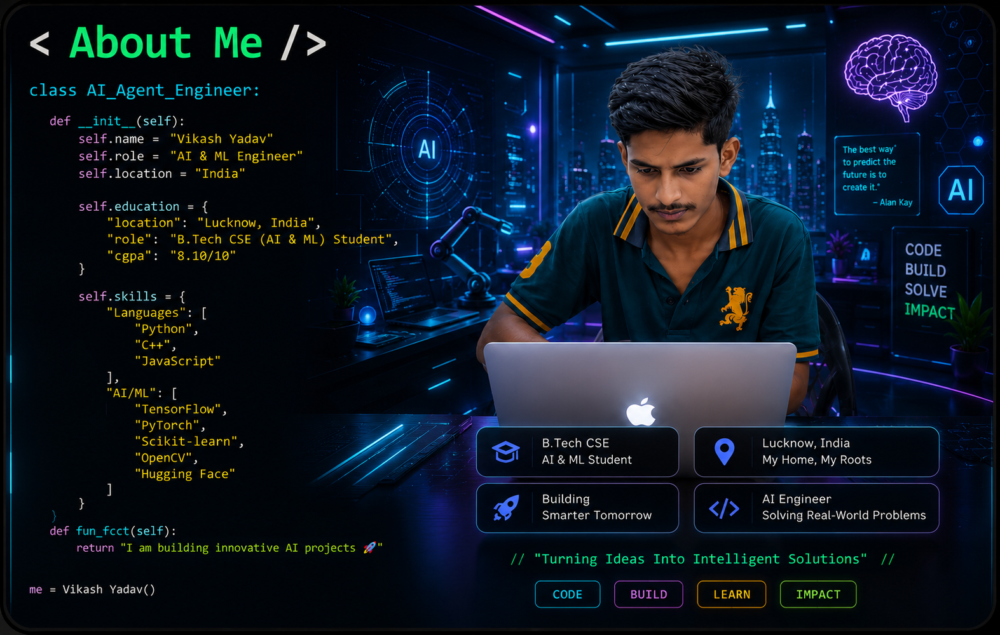
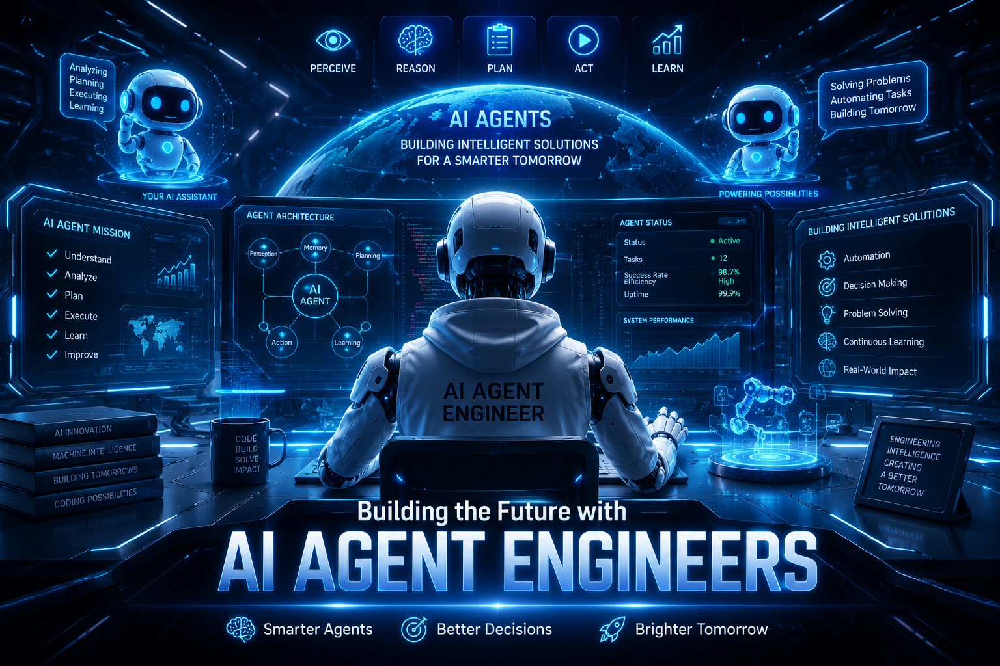

<h1 align="center">Hi 👋, I'm Vikash Yadav </h1>
<h3 align="center">AI & Machine Learning | Deep Learning | Large Language model | NLP |Computer Vision | AI Enthusiast</h3>

  

  

.about-image {
    width: 100%;
    max-width: 1100px;   /* Increase this value */
    height: auto;
    display: block;
    margin: 0 auto;
    border-radius: 10px;
}
---

# 🛰️ Tech Arsenal

## 💻 Programming

---

## 🤖 AI / ML

---

## 📚 Libraries

---

## 🌐 Web Development

---

## 🗄️ Databases

---

## 🛠️ Tools

---

# 🌐 Connect With Me

---

<h3 align="center">
🚀 Building the Future with AI Agent Engineers
</h3>

  <b>
    🤖 Smarter AI Agents &nbsp;•&nbsp;
    ⚡ Better Decisions &nbsp;•&nbsp;
    🤖 Autonomous Agents
    🌍 Brighter Tomorrow
  </b>

 

  

⭐ Thanks for visiting my profile!
